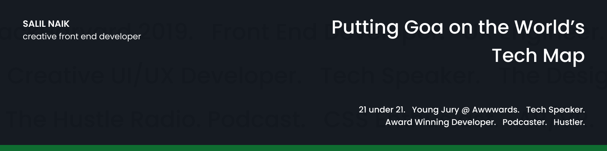

 

If you want to make your own cover image similar to mine 👆, use [Cover Image Generator](http://cover-image-generator.netlify.com/)

## ✍ Blog and writing

| Blog                                                                                                                | Platform          |
| ------------------------------------------------------------------------------------------------------------------- | ----------------- |
| [Understanding the Synthetix Defi protocol.](https://dev.to/salilnaik/understanding-the-synthetix-defi-protocol-368c) | The Practical DEV |
| [What is web a11y and why is it important?](https://dev.to/salilnaik/what-is-web-a11y-and-why-is-it-important-4fic) | The Practical DEV |
| [My HackHarvard 2019 Experience](https://medium.com/@salil.naik27/my-hackharvard-2019-experience-da1b64f4e5c5)      | Medium            |

## 🎙 Podcast - The Hustle Radio

| Episode | Spotify | Google Podcasts | Anchor |
| ------- | ------- | --------------- | ------ |
| Ep 4: The book that changed my life | [Listen on Spotify](https://open.spotify.com/episode/7Kx0Da9k4Vzk8sibAkIEDb?si=Og9a4MUxQ-Gdp0yyRLniHQ) | [Listen on Google Podcasts](https://podcasts.google.com/feed/aHR0cHM6Ly9hbmNob3IuZm0vcy9mNGEwYmI0L3BvZGNhc3QvcnNz/episode/YzI4ZjU1NzQtYjA3Yi00YjU5LTk3ODQtOTMyMmExNTRjNDY5?sa=X&ved=0CAQQ8qgGahcKEwjo6a6Y-5PuAhUAAAAAHQAAAAAQAQ) | [Listen on Anchor](https://anchor.fm/the-hustle-radio/episodes/Ep-4-The-book-that-changed-my-life-eoe8ol) | 
| Ep 3: Learn how to set high goals and achieve them. | [Listen on Spotify](https://open.spotify.com/episode/6x7YOmOevNIpkl9IT5Vv2T?si=QsKwPIzCQRC_OwpdnXRmSw) | [Listen on Google Podcasts](https://podcasts.google.com/feed/aHR0cHM6Ly9hbmNob3IuZm0vcy9mNGEwYmI0L3BvZGNhc3QvcnNz/episode/MTBmMzg4MmMtYjYxNC00M2ZkLWJjZmYtMmQ0N2UyZDRiMWE0?sa=X&ved=0CAUQkfYCahcKEwigu9eg-5PuAhUAAAAAHQAAAAAQAQ) | [Listen on Anchor](https://anchor.fm/the-hustle-radio/episodes/Ep-3-Learn-how-to-set-high-goals-and-achieve-them-e9rcnt/a-a17mv4n) | 
| Ep 2: 10-minute rule. Stop Overthinking. | [Listen on Spotify](https://open.spotify.com/episode/2k2dqNncKN5cOslhu7iFUU?si=PnzVmwXkQn-8DprbF_Iyrg) | [Listen on Google Podcasts](https://podcasts.google.com/feed/aHR0cHM6Ly9hbmNob3IuZm0vcy9mNGEwYmI0L3BvZGNhc3QvcnNz/episode/MmVjMzQxYTUtZDI4ZS0xYTQzLTJiMmItZTEzZWVlMWYzYTJk?sa=X&ved=0CAUQkfYCahcKEwjQmZaL_JPuAhUAAAAAHQAAAAAQAQ) | [Listen on Anchor](https://anchor.fm/the-hustle-radio/episodes/Ep-2-10-minute-rule--Stop-Overthinking-e8ubut/a-a110oh4) | 

[Listen more](https://open.spotify.com/show/5NUCt7kFlBhtenJmPPMozK)

## 🤝 Connect

 &nbsp;&nbsp;&nbsp;
 &nbsp;&nbsp;&nbsp;
 &nbsp;&nbsp;&nbsp;
 &nbsp;&nbsp;&nbsp;
 &nbsp;&nbsp;&nbsp;
 &nbsp;&nbsp;&nbsp;

<!--  

   -->

<!--
**salil-naik/salil-naik** is a ✨ _special_ ✨ repository because its `README.md` (this file) appears on your GitHub profile.

Here are some ideas to get you started:

- 🔭 I’m currently working on ...
- 🌱 I’m currently learning ...
- 👯 I’m looking to collaborate on ...
- 🤔 I’m looking for help with ...
- 💬 Ask me about ...
- 📫 How to reach me: ...
- 😄 Pronouns: ...
- ⚡ Fun fact: ...
-->
